# Algebra Penguins

Algebra Penguins is a website game for people to practice algebra. It is aimed at beginner learners and those whom would like to relearn or practice some mental arithmatic. This website hopes to make algebra both fun and relaxed. The website has an encouraging and easy going approach to the ways it interacts with the user. You can visit the site [here](https://alfreda93.github.io/algebra-penguins/)

## Features 
------

- Algebra Penguins Heading and Main Image
    - At the top of the page, the Algebra Penguins logo and image immediately let the user know that they're on a Maths website which has a game to play.

    
    

- The Guidelines Section
    - The guidelines clearly explain how the game works and how the user can interact and play the game.

     

- The Game Section
    - This is where the game will be played. It included multiple buttons, to start the game, reset the game, choose difficulty (easy or normal) and submit their answer.
    - Before the game starts, the only button which is enabled and clickable is the start button. This encourages the user to click the start button to engage with the game content.

    

- Timer
    - The timer is triggered by clicking the Start button and can be reset at any point after then with the Reset button.
    - The Start button will be made disabled whilst the timer is running, so users cannot launch two timers at once.
    - The Reset button is disabled until the start button is clicked and can be clicked anytime whilst the timer is running.
    - The timer itself is hidden from view until the Start button is clicked. At that point, the timer will start running and show between the Start and Reset buttons.

    

- Difficulty Section
    - The difficulty section shows us two buttons, easy and normal. Allowing users to choose which difficulty they'd like to be challenged with.

    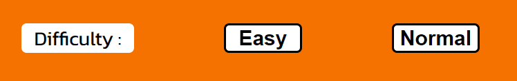

    - The easy difficulty is always a random number between 1-5 multiplied by the value of 'n' which is a random number that is calculated in the javascript and not on view to the user.

    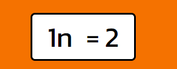

    - The normal difficulty is always random number between 1-12 multiplied by the value of 'n' then with a random operator (either + or -) which adds or subtracts a secondary random number between 1-10. 

    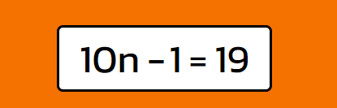

- Equation Section
    - This is where the equation is displayed clearly, so the user can quickly work out the value of 'n'.
    - The game by default starts with the Normal equation. This is how the normal equation looks in full view of the game section.

    

    - The user can then choose whether they want to work out normal equations or easy by clicking the associated easy or normal buttons. Once clicked, this equation will repeat unless otherwise specified (by clicking the opposite button). This how the easy equation looks in full view of the game section.

    

- User Input Section
    - This is where the user can input a number of their choosing to guess the value of 'n' and then submit that answer for evaluation.
    - The answer will also be evaluated if the user presses the enter key instead of clicking the submit button.

    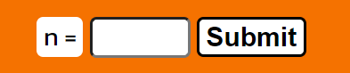

- The Score Section
    - The score will tally up the score of the player as they answer each correct answer.
    - This section shows the current score that the user has. The game gives 2 points for every normal difficulty equation answered correctly and 1 point for every easy difficulty equation answered correctly. 

    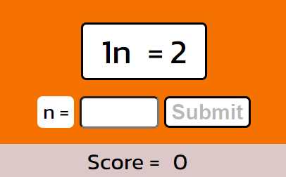

- The Answer Indicator
    - The answer indicator clearly shows the user whether their most recent answer was either correct or not, and if not will tell them the correct answer. This appears next to the scoreboard.

    

    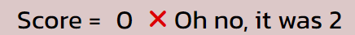

- Alerts
    - This game utilises alerts to interact encouragingly and informatively with the user.
    - There are a few different instances when the alerts are triggered.
    - When the user has finished the game an alert will be triggered notifying the user of their score.

    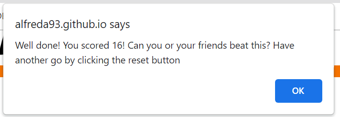

    - If the user didn't get any answers correct and their score is 0 when the timer runs out a different alert is triggered which encourages the user to try again.

    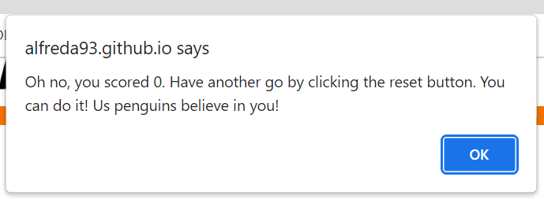

    - If the user presses the enter key after the game timer has ran out, then the following alert will show.

    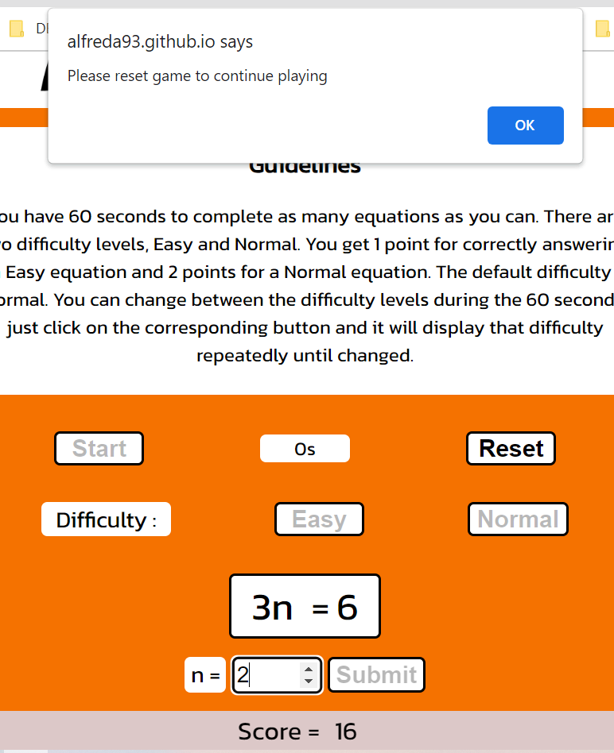

### **Potential Future Features**
- Create a scoreboard so that users can store their scores on an external database and compete with one another.
- Add a hard difficulty with more operators and more complex equations

## Design
------

- The Design for this website was inspired by my high school education. During my highschool maths lessons, classmates who didn’t like algebra decided that they would call it penguins instead, to make it more likeable and approachable.
- This inspired me to draw a penguin image using Adobe Fresco. 
- The font chosen are two that felt both comfy and fun, yet also clear and simple to read, to keep it accessible.
    - The fonts chosen were Gill Sans from Adobe Fresco and Kanit from Google Fonts. 
    - The Colours throughout the website were chosen from the main image and designed to be basic and simple
        - Orange from the beak
        - White from the face and tummy
        - Grey/Orange for the scoreboard that was based on the beak colour but in a grey shade.

    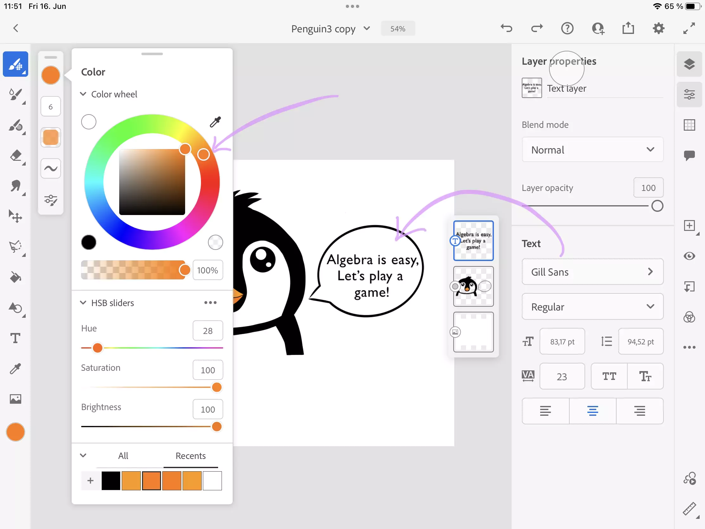

## Testing
------
- I checked the website for responsive design, accessibility and performance on desktop browsers:
    - Chrome
    - Firefox
    - Brave
- I tested the website on Android mobile browser Chrome.

### **Validator Testing**
- **HTML**
    - No errors were found when checking the website with [W3C HTML Validator](https://validator.w3.org/#validate_by_uri+with_options) 

     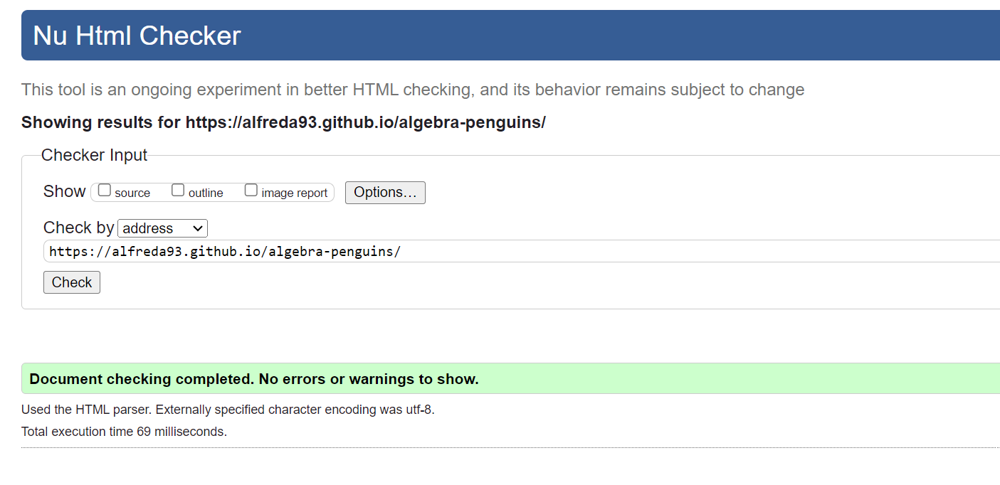
     

- **CSS**
    - No errors were found when checking the website with [W3C CSS Jigsaw Validator](https://jigsaw.w3.org/css-validator/) 

    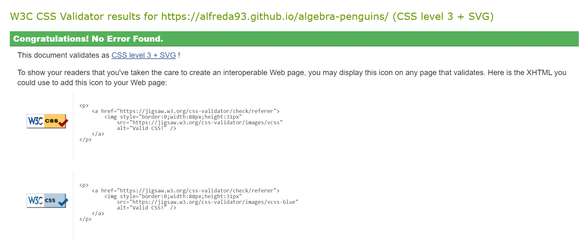

- **JS Hint**
    - No errors were found when checking the JavaScript code using the [JS Hint](https://jshint.com/)
        - The metrics were as follows 
            - There are 20 functions in this file.
            - Function with the largest signature take 3 arguments, while the median is 0.
            - Largest function has 39 statements in it, while the median is 5.
            - The most complex function has a cyclomatic complexity value of 3 while the median is 1.
    - When testing my JavaScript with JS Hint, there were originally 39 warnings associated with it, however these disappeared when I added a section of code `/*jshint esversion: 6 */`  at the top of the document. This was recommended by my Mentor whom confirmed that there wasn't any errors in the code. See screenshots below for clarification.
    - JS Hint with warnings
    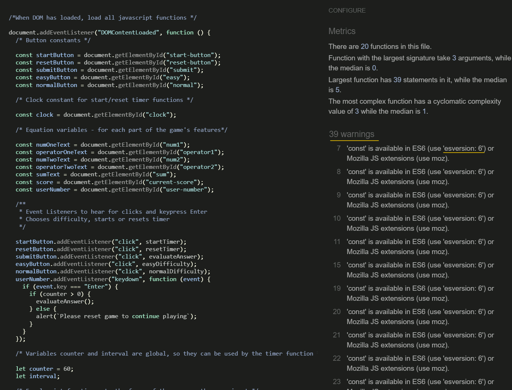
    - JS Hint valid

    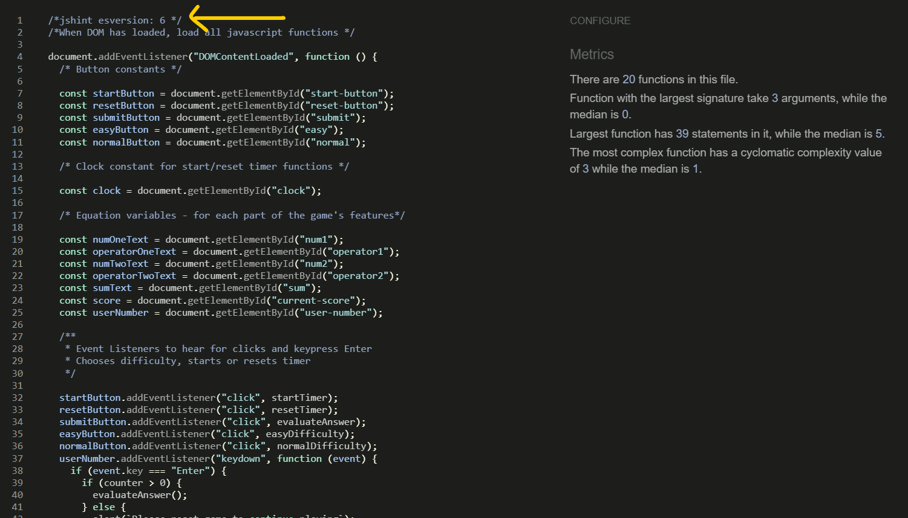

- **Lighthouse**
    - Testing the website with Lighthouse I received a Green Pass on all available classes.
    - This first image is Lighthouse Testing desktop.
    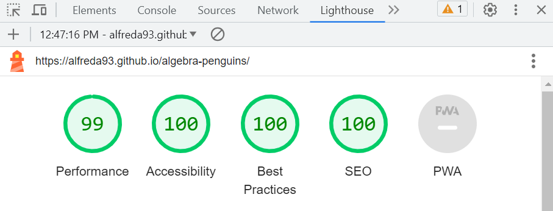
    - This second image is Lighthouse Testing mobile.
    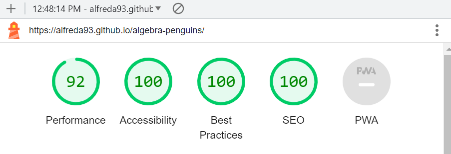

### **Responsiveness**
- The website is responsive to all devices within the ranges specified below.
    - Pixel width : 320 - 400px
    - Pixel width : 401 - 550px
    - Pixel width : 551 - 800px
    - Pixel width : 801 - 900px
    - Pixel width : 900px and above

### **Bugs**

- Problem 1:  When adding complexitity to the equation generator, it broke the script and didn’t function as intended.
    - *Solution 1: Code element `getElementById` was missing from the `document.` part of code.*

- Problem 2: Hard equation doesn’t seem to calculate correctly.
    - *Solution 2: Temporarily remove Hard Equation. I found out later that I had 2 values for 'n' in the writing of this equation, however, I still left the equation difficulty removed due to the complexity of the working out.* 
    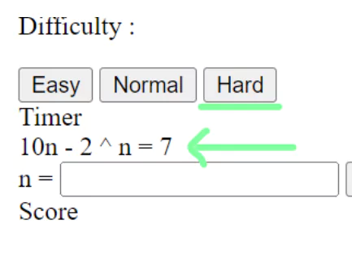

- Problem 3: The value coming out of the calculateAnswer function was NaN
    - *Solution 3: Change `.value` on the code to `.textContent` to then Parse into Integer using `parseInt()` function.*
    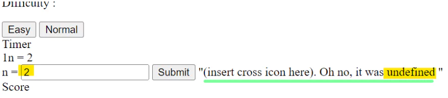

- Problem 4: Calculation in the function `calculateAnswer()` isn't correct.
    - *Solution 4: Sum within CalculateAnswer function() was written the wrong way around*
    

- Problem 5: Timer can have two timers running at once if you click twice on start timer.
    - *Solution 5:  Add a `setAttribute = "disabled"` to the code.

- Problem 6: You can trigger equations to start appearing by pressing enter on the input even through submit button is disabled.
    - *Solution 6: Disable user input until start button is activated.*
    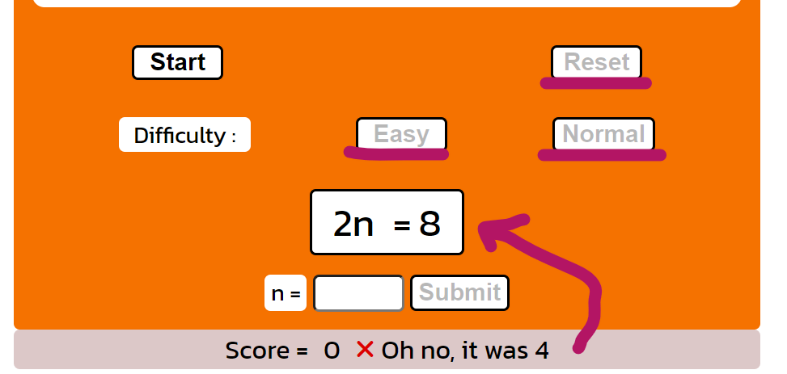
#### **Unfixed Bugs**

- None

## Mistakes
------

I used capitals in the repository name of the gitHub and thus this meant after deployment, there were capitals in my URL.
    - *Solution: I renamed my repository post deployment*

## Deployment
------
Algebra Penguins was deployed onto GitHub Pages. Here are the steps to deploy this website:

- Within the repository name of the project (algebra-penguins), go to the ***Settings*** tab
- On the left hand menu, under ***Code and automation*** subtitle see ***Pages***
- Under ***Build and deployment*** and ***Branch*** choose ***Main***, click Save.
- This page will then refresh and the name of the website with live link will be available within a few minutes.
- Find this link [here](https://alfreda93.github.io/algebra-penguins/)

## Credits 
------
### **Code**

- Love Maths CI Walkthrough Project helped me realise how to create a way to determine how to calculate answer and difficulty level at the same time - using an array. This was applied in the calculateAnswer()
    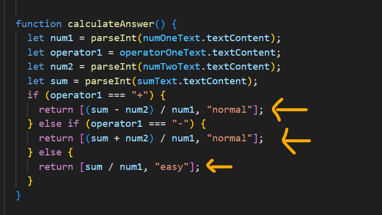

- [Changing the cursor on disabled buttons](https://stackoverflow.com/questions/50349017/how-can-i-change-cursor-for-disabled-button-or-a-in-bootstrap-4)

- My Mentor Alex helped explained the syntax of the timer function to me which I applied a simple version of in my code.

    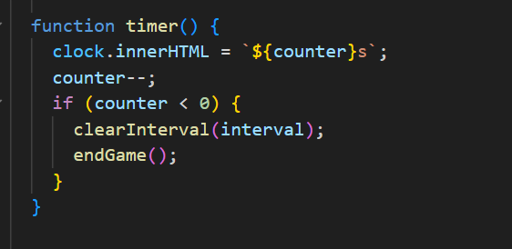

    - [freeCodeCamp](https://www.freecodecamp.org/news/how-to-create-a-countdown-timer/) also assisted in how to create a timer.

### **Helpsheets and Learning Resources**

- Throughout the start of this website build I relied heavily on my notes from the Code Institute JavaScript Essentials part of their course and applied their teachings, to which I am incredibly thankful.

- My mentor Alex was absolutely brilliant in explaining in a simple big picture way what can be done to be improved and where I should place my focus next. I am very thankful for his help and support throughout this website build in understanding sometimes confusing syntax.

- [Adding CSS Styles using JavaScript](https://www.javascripttutorial.net/dom/css/add-styles-to-an-element/)
- [CSS Buttons](https://www.w3schools.com/css/css3_buttons.asp)
- [Random Arrays in JavaScript](https://stackoverflow.com/questions/4550505/getting-a-random-value-from-a-javascript-array)
- [setTimeout() Function](https://www.tutorialrepublic.com/javascript-tutorial/javascript-timers.php)
- [More setTimeout() explanations](https://developer.mozilla.org/en-US/docs/Web/API/setTimeout)
- [Removing an attribute](https://www.w3schools.com/jsref/met_element_removeattribute.asp)

### **Media**
All Media was created and owned by the website author - Alfred Ayre.

### **Technologies used**
- [Favicon](https://www.favicon.cc/) Generator 
- Image Converters
    - [EZ Gif](https://ezgif.com/jpg-to-webp/)
    - [Tiny Img](https://tiny-img.com/webp/)
- [Font Awesome](https://fontawesome.com/) for icons
- [Google Fonts](https://fonts.google.com/) for fonts
- [Adobe Fresco](https://www.adobe.com/products/fresco.html) for image creation

## Wireframes
------
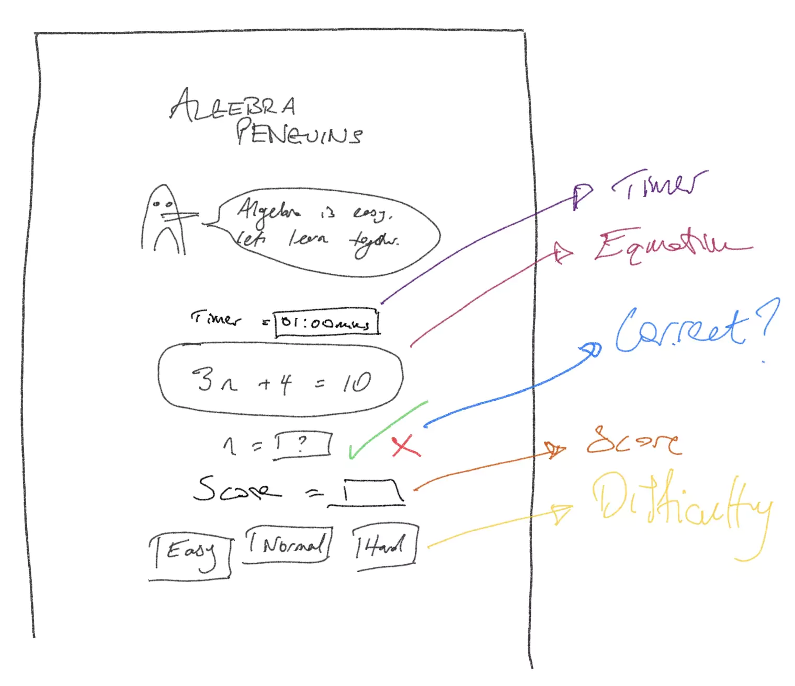
