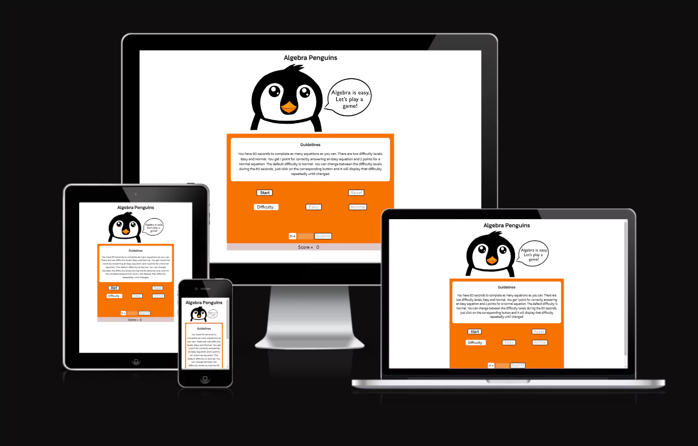
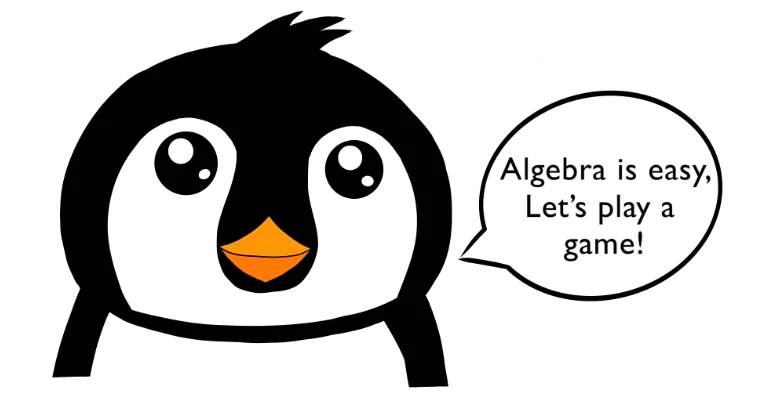
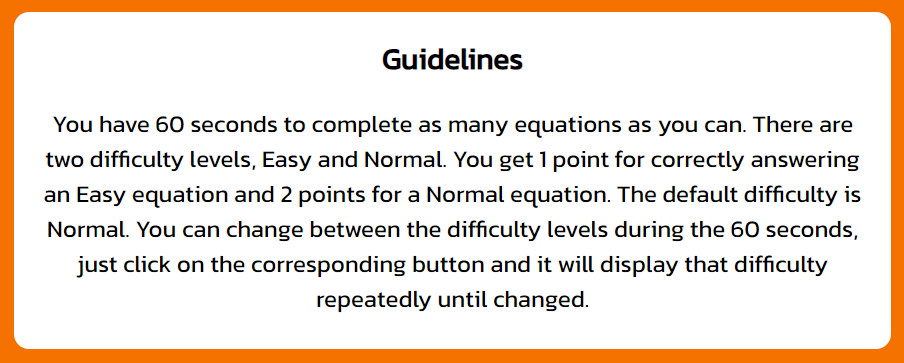
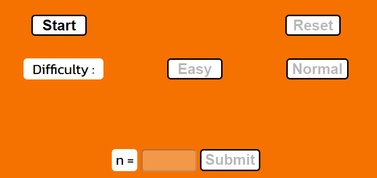
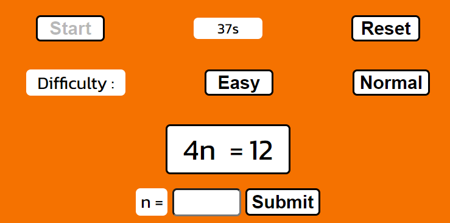
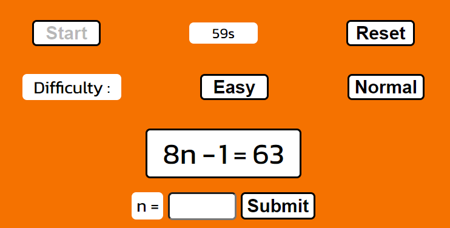

# Algebra Penguins

Algebra Penguins is a website game for people to practice algebra. It is aimed at beginner learners and those whom would like to relearn or practice some mental arithmatic. This website hopes to make algebra both fun and relaxed. The website has an encouraging and easy going approach to the ways it interacts with the user. You can visit the site [here](https://alfreda93.github.io/algebra-penguins/)

## Features 
------

- Algebra Penguins Heading and Main Image
    - At the top of the page, the Algebra Penguins logo and image immediately let the user know that they're on a Maths website which has a game to play.

- The Guidelines Section
    - The guidelines clearly explain how the game works and how the user can interact and play the game.

 

- The Game Section
    - This is where the game will be played. It included multiple buttons, to start the game, reset the game, choose difficulty (easy or normal) and submit their answer.
    - Before the game starts, the only button which is enabled and clickable is the start button. This encourages the user to click the button to find out what happens.

- Timer
    - The timer is triggered by clicking the Start button and can be reset at any point after then with the Reset button.
    - The Start button will be made disabled whilst the timer is running, so users cannot launch two timers at once.
    - The Reset button is disabled until the start button is clicked and can be clicked anytime whilst the timer is running.
    - The timer itself is hidden from view until the Start button is clicked. At that point, the timer will start running and show between the Start and Reset buttons.

- Difficulty Section
    - The difficulty section shows us two buttons, easy and normal. Allowing users to choose which difficulty they'd like to be challenged with.

    
    - The easy difficulty is always a random number between 1-5 multiplied by the value of 'n' which is a random number that is calculated in the javascript and not on view to the user.
    - The normal difficulty is always random number between 1-12 multiplied by the value of 'n' then with a random operator (either + or -) which adds or subtracts a secondary random number between 1-10. 

- Equation Section
    - This is where the equation is displayed clearly, so the user can quickly work out the value of 'n'

### **Potential Future Features**
- 

## Design
------

## Testing
------
- I checked the website for responsive design, accessibility and performance on browsers:
    - Chrome
    - Firefox
    - Brave
### **Validator Testing**
- **HTML**
    - [W3C HTML Validator](https://validator.w3.org/#validate_by_uri+with_options) 

     
     

- **CSS**
    - [W3C CSS Jigsaw Validator](https://jigsaw.w3.org/css-validator/) 

    

- **Lighthouse**
    - 

    

### **Responsiveness**
- 

- 

### **Bugs**

- Problem: 
    - *Solution: *

- Problem: 
    - *Solution: *

- Problem: 
    - *Solution: *

#### **Unfixed Bugs**

- None

## Mistakes
------

including a capital in the repo name

### **Mistakes Conclusion**

## Deployment
------
Algebra Penguins was deployed onto GitHub Pages. Here are the steps to deploy this website:

- Within the repository name of the project (algebra-penguins), go to the ***Settings*** tab
- On the left hand menu, under ***Code and automation*** subtitle see ***Pages***
- Under ***Build and deployment*** and ***Branch*** choose ***Main***, click Save.
- This page will then refresh and the name of the website with live link will be available within a few minutes.
- Find this link [here](https://alfreda93.github.io/algebra-penguins/)

## Credits 
------
### **Content**

### **Helpsheets and Learning Resources**

### **Media**

## Wireframes
------
